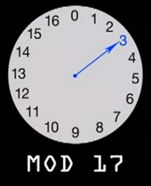

#  An Intro to Auth and Modular Arithmetic

### Objectives:

* Understand the basic math concepts behind modular arithmetic
* Apply this concept to server authentication
* Warm up your brains, have fun (with MATH!) and eat candy

### Warm-up:  The Russian Postal Problem (5-10 minutes)
Today we're going to enact a metaphor for auth inspired by [The Russian Postal Problem](http://www.jwstelly.org/BrainTeaser/Problem.php?id=14)

Form groups and try to solve the problem. (If you've seen this one already, you can give hints, but please don't give it away.)

----
<details>
<summary>Solution:</summary>

* Boris puts the jewel in the box with one lock and sends it to Natasha.
* Natasha puts her own lock on the box and returns it to Boris (with both locks).
* Boris removes his lock with his own key and sends it back with just Natasha's lock.
* Natasha can unlock the box with her key.

</details>
---- 
### [Video: How does this relate to computer passwords?](http://www.wimp.com/how-encryption-works-in-your-web-browser/)

_Note: This is an excellent video, with two gotchas. First, the narrator says "forty-two" when the display shows "46" several times. (46 is correct.) Second, there is a moment when `16^54 mod 17` is converted to `3^(24*54) mod 17` without explanation. This can be simplified and proven more easily using 3^6 and 3^8._

Suppose Alice chose `6` as her random number. She would perform the equation: 
<code>3^6 mod 17 &equiv; 15</code> and send 15 to Bob.
Suppose too that Bob chose `8` as his random number. He would perform the equation:
<code>3^8 mod 17 &equiv; 16</code>, and send 16 to Alice.

Now Alice can start with Bob's public key (16) and raise to the exponent of her secret key:
<code>16^6 mod 17 &equiv; 1</code>
Bob does the same by raising Alice's public key by *his* secret:
<code>15^8 mod 17 &equiv; 1</code>

Now they both know the password, but Eve cannot determine it, because she does not know Alice's `6` or Bob's `8`

The simplified math can be hacked in a reasonable amount of time, but if the secret key was (for example) a 40-digit hexidecimal value, it would take a long, long time.


#### Pairing Activity #1: Test the math
_(This can be done while two volunteers prepare a simplified algorithm for Activity 2)_

* Developers begin with the simplified algorithm `3^n mod 7` as the "shared secret"
* Each developer selects a random number `n` -- this is your "secret key" -- don't share it.
* Perform the calculation `3^n mod 7` and share only the remainder. This is your "public key"
* Take your partner's public key and raise it to your secret key.
* Did you get the same, new remainder?


-----
<details>
<summary>Refer to the table below to get the math. You may also run math in your browser, but remember Javascript numbers are "double-precision 64-bit format IEEE 754 values"</summary>
Of those 64 bits, you need a few to determine it's sign (positive or negative) and a few more in case we need to raise to an exponent. We can prove this by running in the Chrome console:

```
Math.pow(2, 53)
=> 9007199254740992  // CORRECT.
Math.pow(2, 53) + 1
= > 9007199254740992  // INCORRECT! THEY SHOULD NOT BE THE SAME!
Math.pow(2, 53) + 2
= > 9007199254740994  // ADD 2 WORKS!?!?!?
Math.pow(2,53) + 3
= > 9007199254740996
Math.pow(2,53) + 4
= >  9007199254740996 // WHAT IS HAPPENING???

```

[More info Here](http://www.2ality.com/2012/07/large-integers.html)
</details>
-----


#### `3^n mod 17` vs `3^n mod 7` Reference Table

17 and 7 are prime numbers. One of these will be our prime modulus.
The primitive root of a number is one that has no factors in common where, if you raise the root by any exponent, the modulus will return a different value, until the sequence repeats itself.

primitive <br >root | exponent | value | mod 17 | mod 7
----|:----:| ----:|----:|----:
3 | 1 | 3 | **3** | **3**
3 | 2 | 9 | 9 | 2
3 | 3 | 27 | 10 | 6
3 | 4 | 81 | 13 | 4
3 | 5 | 243 | 5 | 5
3 | 6 | 729 | 15 | 1
3 | 7 | 2,187 | 11 | **3**
3 | 8 | 6,561 | 16 | 2
3 | 9 | 19,683 | 14 | 6
3 | 10 | 59,049 | 8 | 4
3 | 11 | 177,147 | 7 | 5
3 | 12 | 531,441 | 4 | 1
3 | 13 | 1,594,323 | 12 | **3**
3 | 14 |  4,782,969 | 2 | 2
3 | 15 | 14,348,907 | 6 | 6
3 | 16 | 43,046,721 | 1 | 4
3 | 17 | 129,140,163 | **3** | 5
3 | 18 | 387,420,489 | 9 | 1
3 | 19 | 1,162,261,467 | 10 | **3**

This can also be illustrated with a clock:



For positive numbers, move clockwise. (For negative numbers, move counter-clockwise.) You can easily see how <code>3^3 mod 17 &equiv; 10</code>

#### Activity 2: Candy from a Lockbox (20 minutes)

_NOTE: The following exercise description DOES NOT reveal the real combinations of the locks. Make sure you know the combinations before you begin._

In our version of the story, Alice (played by a student) has a bunch of candy. Bob (played by a different student) wants Alice to send him some candy without sharing with the rest of the class. Bob has a lock box and a combination lock with a given combination. Alice has another lock with a given combination. (Alice does not know Bob's combo, and vice-versa.)

Before the exercise begins, developers playing Bob and Alice must also agree upon a shared secret--a simple mathematical formula or algorithm to decrypt each others' combinations, such as <code>5 * n mod 12 &equiv; 0 </code>. If the multiplier is 16, Bob will send a public key of 15 and Alice will know that Bob's combo is 15 * 16, or 240.

This is an incredibly simple algorithm, but that's what makes it fun as an in-class activity. _(If the algorithm is more complex, it will be exponentially more difficult for the class to unlock the box, which makes the exercise kind of pointless.)_

Bob sends his request inside the locked box, with public key written on a Post-It on the outside. Bob must pass the box around the class before it gets to Alice. The class can hypothesize and guess different combinations, as many times as the instructor allows. (You might limit it to 3 - 10 attempts, or let the students self-regulate.) Before they begin, you can identify a few points to get them on the right track. (For example, this is a 3-digit combo, so don't do math with very large numbers, negative numbers or decimals.)

Alice will be able to unlock the box, put in the candy and then return it to Bob with her secret key (in this example, 32). Now the class has both public keys and the class can make several more attempts at figuring out the combinations. If it makes it back to Bob, he will be able to unlock both locks.

Whatever happens in class, unlock the box and share the candy.

#### Discussion:  How are these things related? (10 minutes)

* Did the class figure it out? Did they get close?
* How would we change the math to make this more realistic?
* What is modular math and how does it work?
* How does bcrypt use modular math?


#### More Math (time permitting)
[Here is a good explanation of modular math](https://www.khanacademy.org/computing/computer-science/cryptography/modarithmetic/a/what-is-modular-arithmetic)
